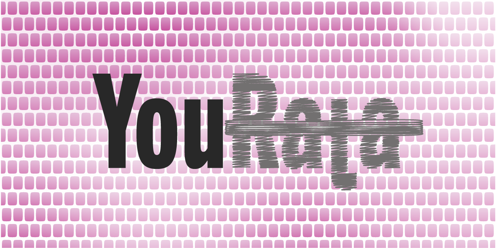

[](https://app.codacy.com/gh/battleship-systems/YouRata/dashboard?utm_source=gh&utm_medium=referral&utm_content=&utm_campaign=Badge_grade)

# Purpose

Millions of people rely on the information found in YouTube videos. However, YouTube does not provide any means for the content creators to edit these videos after publishing. Furthermore, there is no formal, evidence-based feedback process for viewers to contact the creators about errors in the content. This perpetuates the spread of false information and limits sources to only what the creator had access to at the time of publishing.

# Project Overview

**YouRata** is a repository you can use to automatically publish errata files for a YouTube channel. It provides a template for creating a project that runs as a GitHub Action at scheduled intervals. This procedure synchronizes videos on a YouTube channel with errata markdown files to allow subject matter experts and content creators to publish corrections. Like any other file in GitHub, errata bulletins can be modified by viewers through the submission of a pull request.

## Dependencies

This repository template depends on the following packages:
- [@octokit/octokit.net](https://github.com/octokit/octokit.net): GitHub REST API client for creating repository files and manipulating secrets
- [@googleapis/google-api-dotnet-client](https://github.com/googleapis/google-api-dotnet-client): YouTube (Google) Data API client for video information retrieval and update
- [@grpc/grpc-dotnet](https://github.com/grpc/grpc-dotnet): RPC framework for cross-process communication
- [@JamesNK/Newtonsoft.Json](https://github.com/JamesNK/Newtonsoft.Json): JSON file framework
- [@ektrah/libsodium-core](https://github.com/ektrah/libsodium-core): Used to encrypt repository secrets before sending to the API

## Features

- :thumbsup: Automatically creates corrections to display on the YouTube video when errata is submitted
- :thumbsup: Automatically creates an errata link in the YouTube video description
- :thumbsup: Keeps track of API rate limits and regulates synchronization over time
- :thumbsup: Customizable errata bulletin files
- :thumbsup: GitHub native contributing framework with [pull requests](https://docs.github.com/en/pull-requests/collaborating-with-pull-requests/proposing-changes-to-your-work-with-pull-requests/about-pull-requests)

## Architecture
The YouRata project is designed to run completely inside GitHub and store all of its data in the repository. Content creators configure the settings file with their YouTube channel information and store YouTube Data API credentials in actions secrets. YouRata is designed to not require any technical interactions after the initial setup.  

Synchronization with YouTube is achieved by the execution of three worker processes or **milestones**. These programs are executed in series with **conflict monitor** orchestrating their actions.

```bash
└── ConflictMonitor            # ASP.NET Core WebApp for monitoring milestone activity
    ├── InitialSetup           # Creates and verifies repository secrets needed for API communication
    ├── YouTubeSync            # Creates new errata bulletins and updates YouTube video descriptions
    └── ActionReport           # Saves information from the milestones to be consumed on subsequent runs
```

# Getting Started

It is recommended that you have some familiarity with GitHub and the Google Cloud Platform (GCP) before using YouRata for your own YouTube channel. By creating a new project using this template, you start with no history or reference to this repository. This allows you to create a new repository easily without copying and pasting previous content, cloning repositories, or clearing the history manually.

## Initial Setup

1. Click the <kbd>Use this template</kbd> button (you must be logged in with your GitHub account).  
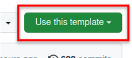
2. Allow the [Template Cleanup](.github/workflows/template-cleanup.yml) workflow to complete so it can remove any template-specific configurations from your repository.  
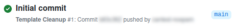
3. Trigger the **Run YouRata** workflow manually and allow it to complete.  
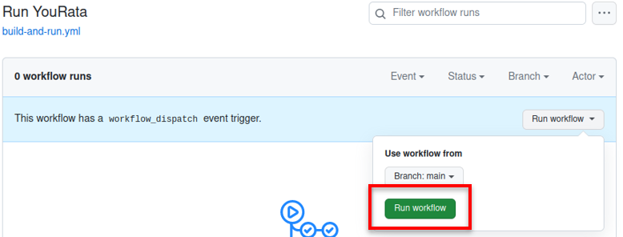
> **Note**
> 
> You can follow the directions printed in the job summary of Run YouRata or you can follow the steps here.

4. Create a GitHub personal access token. Currently personal access tokens are required for the API to update action secrets.
    1. On the [tokens](https://github.com/settings/tokens) page under <kbd>Settings</kbd> -> <kbd>Developer settings</kbd> -> <kbd>Personal access tokens</kbd> -> <kbd>Tokens (classic)</kbd>, generate a new token (classic).  
    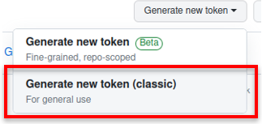
    2. Name the token, select **no expiration**, and select the **repo** scope.  
    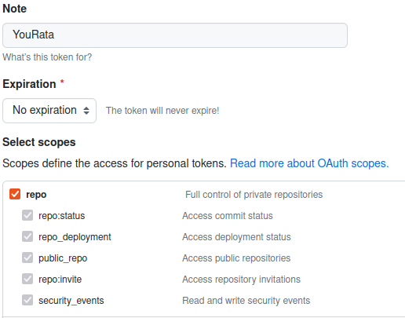
    3. Copy the token and open your YouRata repository.
    4. On the actions secrets page under <kbd>Settings</kbd> -> <kbd>Secrets and variables</kbd> -> <kbd>Actions</kbd>, create a new repository secret.
    5. Name the secret **API_TOKEN** and paste the personal access token into the secret.  
    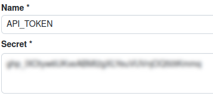
5. Trigger the Run YouRata workflow manually again and allow it to complete.
6. Create a Google Cloud OAuth 2.0 client ID. OAuth credentials are used for the YouTube Data API.
    1. Open the Google Cloud console at [https://console.cloud.google.com/](https://console.cloud.google.com/) and make sure you're signed in with your Google credentials.
    2. Agree to the terms of service.  
    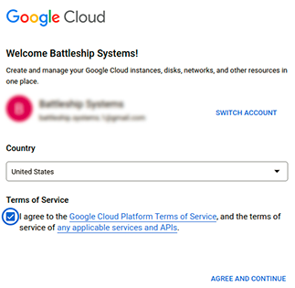
    3. Create a new project.  
    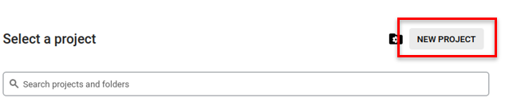
    4. Under the navigation menu select <kbd>More Products</kbd> -> <kbd>APIs & Services</kbd>.  
    
    5. Click <kbd>ENABLE APIS AND SERVICES</kbd> and search for **YouTube Data API v3**.  
    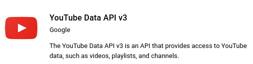
    6. Enable the API and under the navigation menu select <kbd>OAuth consent screen</kbd>.
    7. For the user type select **external** and create the OAuth Consent Screen.
    8. Give your app a name, fill in the required contact information, and continue to the next step.  
    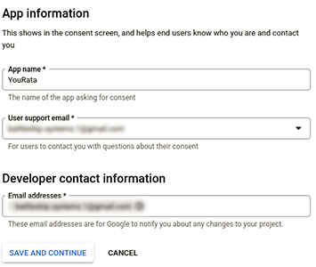
    9. On the scopes page simply continue to the next step.
    10. On the test users page simply continue to the next step.
    11. On the last page click <kbd>BACK TO DASHBOARD</kbd>.
    12. Click <kbd>PUBLISH APP</kbd>. This will allow your app to be used in production.
    13. Under the navigation menu select <kbd>Credentials</kbd>.
    14. Under <kbd>CREATE CREDENTIALS</kbd> click <kbd>OAuth client ID</kbd>.  
    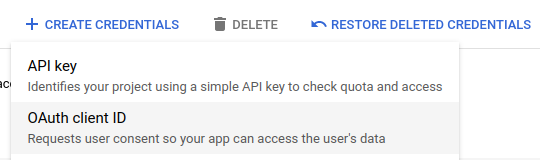
    15. For the authentication type select **Desktop app** and create the client ID.
    16. Copy both the _Client ID_ and _Client secret_ then open your YouRata repository.
    17. On the actions variables page under <kbd>Settings</kbd> -> <kbd>Secrets and variables</kbd> -> <kbd>Actions</kbd>, select the variables tab.
    18. Paste the values into the **PROJECT_CLIENT_ID** and **PROJECT_CLIENT_SECRET** variables.  
    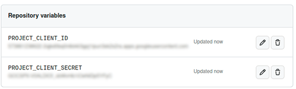
7. Trigger the Run YouRata workflow manually again and allow it to complete.
8. Create a Google Cloud API key. API keys are are used for the YouTube Data API.
    1. On the Google Cloud console under <kbd>CREATE CREDENTIALS</kbd> click <kbd>API key</kbd>.  
    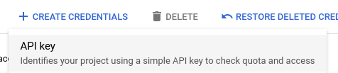
    2. Copy the API key and edit the newly created key.
    3. Under API restrictions select to restrict the key to the **YouTube Data API v3**.  
    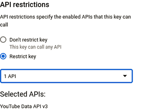
    4. Open your YouRata repository and under <kbd>Settings</kbd> -> <kbd>Secrets and variables</kbd> -> <kbd>Actions</kbd>, edit the **PROJECT_API_KEY** secret.
    5. Paste the API key into the secret value and update the secret.  
    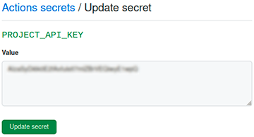
9. Trigger the Run YouRata workflow manually again and allow it to complete.
10. Open the job summary of Run YouRatta and open the link provided in a new window to authorize your GitHub app.  
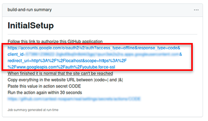  
    > **Note**
    > 
    > At the end of this procedure your browser will show an empty page with a message saying that the site cannot be reached. This is normal and the necessary **code** value is in the URL.  

    1. Sign in with a Google account that has permissions to your channels YouTube videos. The minimum permissions required in YouTube are **Editor (limited)**.  
    > **Warning**
    > 
    > YouRata will impersonate this account indefinitely for all API calls. If this account ever loses its YouTube permissions; YouRata will unable to synchronize any new videos.  

    2. On the unverified app warning page under <kbd>Advanced</kbd> click **Go to My App (unsafe)**. It is normal for the app you just created to be unverified.  
    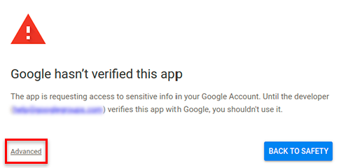
    3. On the allow access page click continue.  
    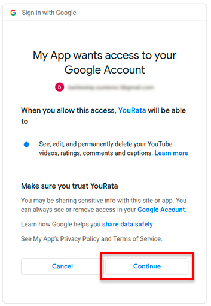
    4. Immediately after the site cannot be reached page is displayed, copy everything in the website URL after **code=** and before **&**.  
    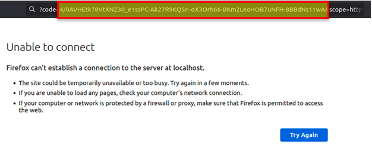
    5. Open your YouRata repository and under <kbd>Settings</kbd> -> <kbd>Secrets and variables</kbd> -> <kbd>Actions</kbd>, edit the **CODE** secret.
    6. Paste the code into the secret value and update the secret.
10. Trigger the Run YouRata workflow manually again and allow it to complete. In the job summary make sure that the Google API token response has been saved.
11. Configure the **yourata-settings.json** file with your YouTube channel ID and any desired settings.  
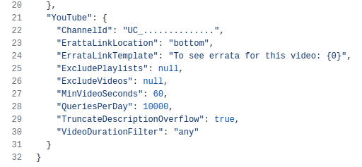
12. Edit the [Run YouRatta](.github/workflows/build-and-run.yml) workflow cron schedule to run when you want YouRata to synchronize videos with YouTube.

# Contributing to YouRata

See [the contributing guide](CONTRIBUTING.md) for detailed instructions on how to get started with our project.

# License

The source code to YouRata is provided under the [MIT license](./LICENSE)
